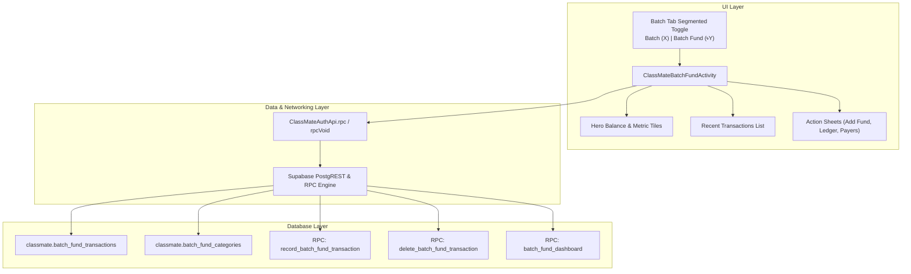
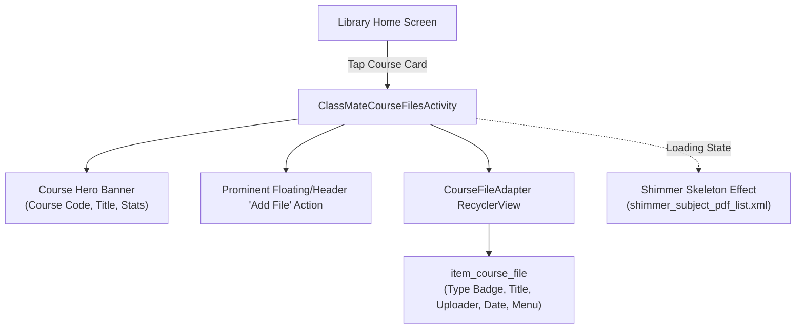

# ClassMate Platform & Android APK — Complete Architecture, Memory & Debugging Reference

This memory file serves as the definitive engineering knowledge base and memory reference for the ClassMate Android APK project, Web companion client, and Supabase backend. It documents architecture, design tokens, data models, recent features, debugging resolutions, and implementation guidelines across all modules.

---

## 1. High-Level Overview & Core Concepts

- **Purpose**: The Notice page/feed is the central academic broadcasting and engagement hub in ClassMate. It delivers announcements, class cancellations, resources/file attachments, exam notices, and deadlines to students and faculty.
- **Dual Architecture**:
  1. **Modern Supabase Academic Screens** (`ClassMateAcademicScreensSupabase.kt`): The active, production architecture powering ClassMate 1.1.23+ with smooth ListAdapter paging, real avatars, threaded comments, read receipts, and AI compose.
  2. **Legacy / Complementary Components** (`NoticeFragment.kt`, `NoticeAdapter.kt`, `NoticeRepository.kt`, Room DB `NoticeDao.kt`, Firestore): Kept for offline caching, hybrid fallbacks, and backward compatibility.
- **Web App Parity** (`web/src/components/notices.tsx`, `notice-comments.tsx`): Full functional parity with Android — responsive mobile feed and persistent desktop right-hand rail, real avatars, reaction toggles, keyset paging, translation, and reader dialogs.

---

## 2. Notice Types, Context Art & Presentation

Every notice card is visually distinct based on its classification:
- **General Notice**:
  - Background: `bg_notice_premium_general` (light gray/subtle surface)
  - Icon: Megaphone art (`ic_notice_megaphone_art`), tinted `cm_notice_premium_general` (`#4F46E5` / purple-blue)
  - Accent line: `bg_notice_premium_accent` / `cm_notice_premium_general`
- **Class Cancellation**:
  - Detected by: `class_change_id != null` or title containing cancellation keywords (`Class cancelled`, `cancellation`, etc.)
  - Background: `bg_notice_premium_cancel` (soft red/coral tint)
  - Icon: Calendar with cross art (`ic_notice_calendar_cancel_art`), tinted `cm_notice_premium_cancel` (`#DC2626` / red)
  - Dynamic Effect: Automatically links to `class_changes` in Supabase; affected periods in the Timetable turn red with `CANCELLED` badge instead of `CLASS`/`LAB`.
- **Resource / Protected File**:
  - Detected by: `resource_id != null` or title prefixed with `Resource: `
  - Background: `bg_notice_premium_resource` (soft emerald/teal tint)
  - Icon: Document/book illustration (`ic_notice_resource_art`), tinted `cm_notice_premium_resource` (`#059669` / green)
  - Attachment Card: Shows `tvFileName`, `tvFileSize` ("Tap to open protected file"), `tvFileExtension` ("FILE"), and opens via secure signed R2 URL (`openFile`).
- **No Extraneous Badges**:
  - No artificial status pills (like "Important", "Urgent", or "Exam" pills) are rendered inside modern cards; titles themselves can contain emphasis.

---

## 3. Card UI Layout & Performance Architecture (Android)

### Performance & Scrolling (`ClassMateNoticeRows.kt`)
- Implemented as an immutable **`ListAdapter<ClassMateNoticeRow, ClassMateNoticeRows.Holder>`** using `DiffUtil.ItemCallback`.
- **Row Signatures**: Each card has a unique composite signature string (`signature`) containing item data, read counts, engagement state, reader preview fingerprint, translation status, search query, and user role.
- **Granular Diffing**: When likes, read counts, or search queries change, only the affected row invalidates. The entire adapter is never reset, eliminating scroll jumps, flickering, and dropped frames.
- **View Retention**: ViewHolders and Glide image requests are preserved during paging updates.
- **State Restoration**: `stateRestorationPolicy = StateRestorationPolicy.PREVENT_WHEN_EMPTY`.

### Text Rendering & Inline Expansion (`ClassMateNoticeText.kt`)
- **Search Highlighting**: Matches are highlighted using `BackgroundColorSpan(cm_search_highlight)` (bright yellow) and `ForegroundColorSpan(cm_search_highlight_text)`.
- **URL Linkification & Precision Hit-Testing**: `Linkify.addLinks(..., Linkify.WEB_URLS)` makes web URLs clickable. `findClickableSpanUnderTouch` verifies line horizontal and vertical bounds (`x >= layout.getLineLeft(line)` and `x <= layout.getLineRight(line)`) before triggering `onClick` and consuming the touch. URLs open cleanly without triggering card ripples or false expansion toggles.
- **1200-Character Layout Bound**: Cards clamp preview string length to `minOf(body.length, 1200)` before calculating `StaticLayout`, preventing multi-thousand character rendering slowdowns while supporting 6-line previews.
- **Unicode Safety**: High-surrogate boundaries are respected (`Character.isHighSurrogate(body[end - 1])`) to prevent emoji truncation crashes.
- **6-Line Truncation & Lowercase "… see more"**:
  - Truncates at up to 6 lines (instead of 3).
  - Strictly appends `"… see more"` only if the text overflows 6 lines; shorter text ($\le 6$ lines) displays completely without any button.
  - Tapping `"… see more"` or tapping the notice title (only when expandable) expands the card inline directly in the feed.
- **Inline Expansion & Lowercase "see less"**:
  - Eliminates separate popup modals for viewing notices.
  - Short notices ($\le 6$ lines) are guarded by `isExpandable(body)`: clicking title does not toggle expand, and `"  see less"` is never appended.
  - When genuinely overflowing text is expanded, shows full text and appends an inline `"  see less"` clickable span to collapse back smoothly.
  - Card root click listener is removed (`cardRoot.isClickable = false`), avoiding unwanted card-wide tap animations.
- **Click & Hold (Long-Press) to Copy**:
  - Custom `setupCollisionFreeTouch` detects touch hold (>= 400ms), triggers native haptic vibration (`HapticFeedbackConstants.LONG_PRESS`), copies `"$title\n\n$body"` to clipboard, and shows a `"Notice copied"` toast.
  - Link collision protection: if long-pressed over a URL or expand button, the link click is canceled so the browser is not opened.
  - Suppresses teardrop cursor handles and text selection popups (`movementMethod = null`, transparent highlight).

### Notice Summary Row (`item_notice_summary.xml`)
- Rendered at the top of the feed (position 0 when active).
- Displays the most recent author's avatar (`ivSummaryAvatar`), name (`tvSummaryName`), total update count, and latest post date (`tvSummaryMeta`).

### Modern Notice Card Header & Body (`item_notice_modern.xml`)
- `noticeAccent`: 3dp colored vertical indicator matching the notice type.
- `tvTitle`: Bold 18sp title, expands to full lines when card is expanded. Tapping toggles inline expand/collapse only when expandable; holding copies notice.
- `ivNoticeIllustration`: Megaphone, calendar cancellation, or resource art.
- `btnOptions`: 3-dot management button (`ic_more_vert`). Only enabled/opaque (alpha 1f) for owner, CR, or the notice's author. Opens action dialog with "Edit title and message" and "Delete notice".
- `tvPreview`: Truncated 6-line body with inline expand/collapse and long-press copy support.
- `tvMeta`: Date formatted with calendar clock outline icon (`ic_notice_date_small`).
- `btnTranslate`: Constrained rounded ripple mask (`bg_btn_translate.xml`) with small language icon (`ic_translate_small`) + "Translate" / "Original". Eliminates giant circular bubble, matching web UX.

### Card Footer Actions (`item_notice_modern.xml`)
1. **Notice Reminder (`btnReminder`, `ivReminderIcon`)**:
   - Bell outline (`ic_notice_reminder_outline`, muted) or active bell (`ic_notice_reminder_active`, tinted `cm_primary`).
   - Tapping opens reminder options: "In 1 minute", "In one hour", "Tomorrow at 9 AM", "Clear reminder".
   - Scheduled via `ClassMateNoticeReminderScheduler` (uses `AlarmManager.setExactAndAllowWhileIdle` and fallback `ClassMateNoticeReminderWorker`).
2. **Seen / Read Receipts (`btnReadReceipts`, `tvReadCount`, `seenAvatars`)**:
   - Overlapping reader avatars: CircleImageViews showing up to 4 real reader avatars (22x22 dp, marginStart offset = index * 14 dp, 1dp border).
   - Label: `X seen` (compact formatted: `1.2k`, `3.5m`).
   - Tapping opens the **Seen by** Dialog: Displays list of students who read the notice, with names, avatars, read timestamps, and **50-reader keyset pagination** ("Load more" via `notice_readers_page`).
3. **Idle Scroll Read Tracking (`markVisibleNoticesRead`)**:
   - Monitored on `RecyclerView.SCROLL_STATE_IDLE`.
   - Checks visible items where at least 50% of the card height is visible inside the RecyclerView bounds.
   - Debounces notice IDs into a local `noticeReadSent` set to prevent duplicate RPC calls.
   - Calls Supabase RPC `mark_notices_read(target_ids)`. Optimistically prepends user's avatar and increments seen count.
4. **Like Button (`btnLike`, `ivLikeIcon`, `tvLikeCount`)**:
   - Heart outline (`ic_heart_outline`) or filled (`ic_heart_filled`, tinted red `cm_notice_like`).
   - Optimistic toggle with debounced RPC update to `notice_reactions`.
5. **Comments Button (`btnComment`, `tvCommentCount`)**:
   - Chat bubble icon (`ic_comment_outline`) with comment count.
   - Tapping opens the threaded social comments modal / bottom sheet.

---

## 4. Social Comments System

- **Backend Table**: `classmate.notice_comments` (with `id`, `notice_id`, `author_id`, `parent_id`, `body`, `client_request`, `created_at`, `updated_at`, `deleted_at`).
- **Likes on Comments**: `classmate.comment_likes` (table linking `comment_id` and `profile_id`).
- **Features**:
  - **Threaded Replies**: Root comments (`parent_id = null`) and nested replies (`parent_id = root.id`).
  - **Keyset Pagination**: RPC `comment_page(target_notice, target_parent, before_time, before_id)` fetches 50 items per page sorted by `created_at DESC, id DESC`.
  - **Idempotency**: Unique constraint on `(author_id, client_request)` using client-generated UUID prevents duplicate posts on network retry.
  - **Soft Deletion**: `delete_notice_comment(target_id)` sets `deleted_at = now()` and soft-deletes child replies. Allowed only for comment author or app owner.
  - **In-place Editing**: `save_notice_comment` updates existing comment text (enforces max 2,000 characters).

---

## 5. Web Notice Page Architecture (`web/src/components/notices.tsx`)

- **Dual-Mode Rendering**:
  - Mobile: Full dedicated screen accessible via bottom navigation.
  - Desktop: Persistent, resizable right-hand sidebar rail (`NoticeRail`) alongside the schedule workspace.
- **Infinite Query (`useInfiniteQuery`)**:
  - Key: `[ctx.user, ctx.batch, "notices"]`.
  - 10 notices per page using keyset pagination: `published_at < cursor.published_at OR (published_at = cursor.published_at AND id < cursor.id)`.
  - Calls RPC `notice_feed_details` for each page to retrieve bulk engagement, reads, author profiles, and 4-avatar previews.
  - Auto-refreshes every 30 seconds when tab is active.
- **Intersection Observer**:
  - Automatically loads the next 10 notices when scrolling near the bottom `paging` sentinel.
- **Offline Resilience**:
  - Syncs pages to `localStorage` via `saveAcademic` / `readAcademic`. If offline, loads cached pages seamlessly.
- **Instant Search**:
  - Search input filters currently loaded notices with instant highlighted marks (`<mark>`).
- **Bengali Translation**:
  - Calls Edge Function `classmate-ai` with `mode: "translate"`.
  - Translates title and body to Bengali; button toggles between "Translate" and "Show original".

---

## 6. Notice Posting & AI Compose

### Posting Channels:
1. **Web (`NoticeComposer`)**:
   - Accessible to Owner, active Batch CR, or Teacher assigned to a course.
   - Tabs:
     - **AI compose** (Default for Owner and CR): Natural language messy input (English or Bengali). AI parses course, dates, and intent.
     - **General notice**: Title, message, course picker (if teacher without general post rights).
     - **Class cancellation**: Course picker, day selector (Today or Tomorrow).
2. **Android (`PostNoticeActivity.kt`)**:
   - Segments:
     - Normal Notice / AI Posting Mode.
     - Class Cancellation (prompts course and date picker).
     - Vacation / Notice details.
     - Image & PDF Attachment picker (validates image type JPG/PNG/WebP, max 10MB).
   - Polishing with AI: `AIService.analyzeAndPolishNotice` cleans up messy drafts and suggests subject/type.

### The `/silent` Directive
- Typing `/silent` at the beginning of a notice title or body:
  - Database trigger `normalize_silent_notice` strips the `/silent` keyword and sets `silent = true` in `classmate.notices`.
  - Trigger `enqueue_notice()` checks `if new.silent then return new; end if;`.
  - **Effect**: Notice is published directly into the feed, but **no push notifications (FCM or Web Push)** are dispatched into `notification_outbox`.

---

## 7. Role & Authorization Rules

| Role | Reading Feed | Posting Permissions | Special Rules |
| :--- | :--- | :--- | :--- |
| **Student** | Reads batch notices | None | Can like, comment, seen, bookmark, translate |
| **CR (Class Rep)** | Reads batch notices | Can post general notices & cancellations to their assigned batch | Scoped strictly to their own batch (`cr_batch_id == batch_id`) |
| **Teacher** | **Only sees their own posted notices** (`author_id = teacher_id`) | Can post notices for courses they are assigned to | No student unread badges or onboarding prompts |
| **Admin / Owner** | Reads all batches | Can post anywhere, edit/delete any notice, bypass restrictions | Full system oversight |

---

## 8. Backend RPC & Database Schema Reference

### Core Table: `classmate.notices`
- `id` (uuid, PK)
- `department_id` (uuid, FK)
- `batch_id` (uuid, FK)
- `semester_course_id` (uuid, FK, nullable)
- `author_id` (uuid, FK `classmate.profiles`)
- `resource_id` (uuid, FK `file_metadata`, nullable)
- `class_change_id` (uuid, FK `class_changes`, nullable)
- `title` (text, not null)
- `body` (text, not null default '')
- `published_at` (timestamptz, default now())
- `silent` (boolean, default false)

### Key Database RPCs:
- `post_notice(target_batch, target_course, notice_title, notice_body)`: Creates notice and queues notification outbox.
- `post_cancellation_notice(target_batch, target_course, change_date)`: Creates both `class_changes` record and cancellation notice.
- `edit_notice(target_id, target_title, target_body)`: Updates title/body; preserves author permissions.
- `delete_notice(target_id)`: Removes notice and associated comments/reactions.
- `notice_feed_details(target_ids)`: Materialized batch query returning JSON with:
  - `engagement`: `like_count`, `comment_count`, `is_liked`, `is_pinned`, `reminder_at`
  - `authors`: `author_name`, `avatar_url`
  - `reads`: `read_count`, `read_by_me`
  - `previews`: Top 4 reader profiles (`profile_id`, `reader_name`, `avatar_url`, `read_at`)
- `mark_notices_read(target_ids)`: Inserts rows into `classmate.notice_reads`.
- `notice_readers_page(target_notice, before_time, before_id, page_size)`: Keyset pagination for reader list dialog (default 50).
- `comment_page(target_notice, target_parent, before_time, before_id)`: 50-item keyset pagination for threaded comments.
- `save_notice_comment(...)`, `delete_notice_comment(...)`, `set_comment_like(...)`.

---

## 10. Notice Badges, Admin Privacy & Instant UI Mechanics (New Architecture)

### A. Notice Tab Unread Badge Behavior
- **Trigger**: The notices tab icon badge in bottom navigation (`GlassBottomNavView` / `ClassMateUnreadActivity`) only displays when there is at least one published notice in the user's batch that has **not** been read by the user.
- **Immediate Dismissal**: As soon as the user opens the notices tab and views visible notices (or scrolls through all unread notices), `markVisibleNoticesRead` invokes `onNoticeRead()`.
- **0ms Badge Clearing**: `ClassMateUnreadActivity.clearNoticeBadge()` is immediately executed to clear the badge locally without awaiting a network roundtrip, followed by background synchronization.

### B. Admin Read Receipts Privacy Toggle
- **Database & Preferences**: Controlled by `owner_preferences.read_receipts_enabled` (backed by `AppPreferences.isNoticeReadReceiptsEnabled()` on Android and query `owner-preferences` on Web).
- **Backend Enforced Privacy** (`supabase/migrations/202610070002_notice_badge_and_admin_privacy.sql`):
  - When an admin has turned off read receipts (`read_receipts_enabled = false`):
    - `mark_notices_read` still records the read in `classmate.notice_reads` so the admin's personal `unread_activity` accurately drops to 0 (clearing their badge).
    - However, `notice_feed_details`, `notice_reader_previews`, and `notice_readers_page` explicitly filter out any reader whose profile is an admin owner with `read_receipts_enabled = false`.
    - The public `read_count` excludes reads by admins who opted out.
- **Client-Side Enforced Privacy**:
  - Android: `bindSeenAvatar` and `showNoticeReadReceipts` filter out the admin's profile if `profile().optString("role") == "admin" && !appPrefs.isNoticeReadReceiptsEnabled()`.
  - Web: `NoticeCard` (avatar preview list) and `ReaderList` modal filter out the admin profile when `ctx.owner && receiptsEnabled.data === false`.

### C. Instant 0ms Optimistic Notice Posting
- **Android**: `ClassMatePublishActivity` passes the newly created notice JSON back in `result.data.getStringExtra("created_notice")` with `RESULT_OK`. `ClassMateAuthActivity` retrieves it and invokes `academicScreens.onNoticeCreated(json)`, which immediately prepends the notice to `noticeFeed`, updates the local cache, and renders the feed in 0ms without full-screen loading spinners.
- **Web**: `NoticeComposer` returns the created notice from `post_notice` / `post_cancellation_notice`. The `done(created)` callback prepends it directly to TanStack Query's infinite query cache (`pages[0].entries`) and invalidates queries in the background.

### D. Instant Read Receipts & Initial Layout Marking
- **Initial Layout Trigger**: When opening the notices tab, `markVisibleNoticesRead` is triggered via `list.post` on initial layout or if `list.height == 0`, ensuring notices visible upon opening are marked as read without requiring user scrolling.
- **Optimistic State**: Read counts and avatars update in-memory (`noticeReadCounts`, `noticeReaderPreviews`) and cache immediately upon view.

---

## 11. Premium Facebook-Style Comment System Architecture

### A. Core UX & Modal Design
- **Separate Popup Layout**:
  - **Android**: Displays as an interactive `BottomSheetDialog` using `R.style.Theme_ClassMate_BottomSheetDialog` (with `WRAP_CONTENT` / peek behavior and soft top rounded corners). Contains a drag handle, pinned header with notice title and comment count pill, and an `OnBackPressedCallback` / close cross.
  - **Web**: Modern Facebook modal overlay (`.comments-modal-shell`, `.comments-modal-container`, `max-w-2xl`) with backdrop blur, pinned header, scrollable body (`.comments-body-scroll`), and sticky bottom composer.
- **Visual Facebook Aesthetics**:
  - **Speech Bubble Design**: Comments and replies are encased in distinct bubble backgrounds (`bg_comment_bubble.xml` with `#F1F5F9` surface, soft borders, and 18dp corner radii).
  - **Author Badges**: Notice authors have a distinct visual badge ("Author" / "Admin") rendered beside their name in both parent comments and replies.
  - **Engagement Row**: Directly below each bubble is a compact engagement row featuring timestamp, `Like` button with optimistic count increment, `Reply` button, and context menu trigger.
  - **Floating Heart / Like Counter**: Active likes display a floating heart counter badge (`❤️ count`) positioned on the comment bubble.

### B. Compact Bottom Composer System
- **Size & Layout**:
  - Engineered with a compact capsule design (`bg_comment_input_capsule.xml` on Android, `.comment-sticky-footer` on Web).
  - Web textarea is capped with `max-height: 110px`, `min-height: 40px`, and auto-resizing.
  - Android `EditText` has `maxLines="3"` with `inputType="textCapSentences|textMultiLine"`.
  - Accompanied by a circular send button with smooth enable/disable states based on text length.
- **Contextual Reply Banner**:
  - When tapping "Reply" on any comment, a slim contextual banner appears above the input capsule: `"Replying to [Name]"` with a quick cancel (`✕`) button.
  - Submitting automatically clears the reply target and routes to the appropriate thread.

### C. Threaded Reply Trees (Inline Branching)
- **Nested Hierarchy Without Secondary Dialogs**:
  - Rather than opening nested popups for child comments (which fragment context), replies are displayed inline directly beneath the parent bubble.
  - Indented tree structure with visual branching guides (`.reply-thread` with vertical line on Web; nested `LinearLayout` with left border indentation on Android).
  - **"View X replies" / "Hide replies" Toggle**: Collapsible reply toggle preserves clean feed scanning. Tapping fetches child comments via `comment_page(target_notice, parent_id)` and loads them smoothly.
- **Edit & Delete Action Menus**:
  - Authors and Admins have quick access via 3-dot popup menu (`PopupMenu` on Android, dropdown on Web) to edit comment text or delete comments.

---

## 12. WhatsApp-Style "Message Info" (Read Receipts) Subsystem

### A. Core UX & Visual Hierarchy
- **Trigger**: Tapping the "Seen by" avatars or read count on any notice card opens the dedicated WhatsApp "Message info" view instead of a generic dialog.
- **Top App Bar**:
  - Contains a back arrow navigation button (`ic_arrow_back` / `ArrowLeft`) and bold title `"Message info"`.
  - Android includes an optional refresh icon button (`ic_refresh`) to re-fetch the latest readers without reopening.
- **Chat Wallpaper & Outgoing Message Bubble**:
  - **Wallpaper**: Chat wallpaper container with subtle doodle dot pattern (`bg_whatsapp_wallpaper.xml`, `#EFEAE2` light, `#0B141A` dark).
  - **Outgoing Bubble**: Aligned to the right with rounded corners (`bg_whatsapp_bubble.xml`, `#D9FDD3` light, `#005C4B` dark), displaying:
    - Bold notice title (if present).
    - Notice body text (with clickable URL linkification).
    - Meta row with notice timestamp (e.g., `12:10 am`) and checkmarks (`✓✓` in `#53BDEB`).
- **"Read by" Section Card**:
  - **Header**: Text `"Read by"` in WhatsApp green (`#00A884`), accompanied by blue double checkmarks (`✓✓` in `#53BDEB`) and total reader count badge (e.g., `(7)`).
  - **Readers List**:
    - **Avatar**: Circular profile image (`CircleImageView` / ``). If absent, dynamically falls back to a colored circular initial badge (using a hash of the reader's name mapped across a vibrant WhatsApp palette: `#00A884`, `#3B82F6`, `#8B5CF6`, `#EC4899`, `#F59E0B`, etc.).
    - **Reader Name**: Bold primary typography.
    - **Read Timestamp**: Exact WhatsApp relative formatting:
      - `Today, 12:11 am` (for reads on the current day)
      - `Yesterday, 10:15 pm` (for reads on the previous day)
      - `07 Oct, 9:20 am` (for older reads within the current year)
    - **Divider**: Inset 70dp divider line between items.
  - **Empty State**: Displays `"No one has read this notice yet"`.
  - **Pagination**: Supports 50-item keyset pagination via `notice_readers_page` with a `"Load more"` button.
- **Privacy Enforcement**:
  - Automatically respects `owner_preferences.read_receipts_enabled`. If an admin has disabled read receipts, their entry is filtered out on both Android and Web.

---

## 13. Self-Hosted In-App Update Subsystem (GitHub Releases & PackageInstaller)

This section documents the non-Play Store update pipeline, client-side security verification, download resumption mechanics, and UI presentation.

### A. High-Level Architecture & Asset Distribution
- **Distribution CDN**: ClassMate uses the public GitHub repository releases (`shuaibuddowla/ClassMate/releases/latest/download`) to distribute updates over HTTPS without custom server or S3 hosting fees.
- **Release Assets**:
  - `update.json`: Lightweight manifest containing `versionCode`, `versionName`, `minSupportedVersionCode`, `apkUrl`, `apkSize`, `sha256`, `mandatory`, `releaseDate`, and `releaseNotes`.
  - `classmate-<versionName>.apk`: Immutable production APK signed with keystore alias `key0`.
- **Publishing Pipeline (`publish-classmate-github-update.ps1`)**:
  - Pre-publication checks: git dirty state, remote push alignment, `aapt` package and version verification (`com.shuaib.classmate`), `apksigner` certificate fingerprint matching `keystore.properties` (`releaseCertSha256`), and presence of updater configuration in DEX bytecode.
  - Draft-first publishing: Creates draft release, uploads versioned APK first, uploads `update.json` last, verifies assets and SHA-256 digests on GitHub, then marks the release as latest.
  - Automated FCM Push Broadcast: Invokes `notify-classmate-release.ps1` -> Supabase Edge Function `publish-classmate-release` with `x-dispatch-secret`, immediately notifying active devices across batches without waiting for periodic polling.

### B. Client Security & Cryptographic Integrity (`ApkVerifier.kt`, `UpdateSafety.kt`)
Before any installation session is committed, the APK candidate is verified strictly:
1. **Size & SHA-256 Digest**: Exact byte count and SHA-256 hash match against `update.json`.
2. **Package Name & Version Code**: Verifies `archive.packageName == context.packageName` and `candidateCode > installedCode`. Downgrade attacks are rejected.
3. **Certificate & Key Rotation History**:
   - Inspects `signingInfo.apkContentsSigners` against the installed app's signer.
   - On Android 9+ (API 28+), inspects `signingCertificateHistory` to support cryptographic signing key rotation without breaking update continuity.
   - Rejects debug keys or mismatched certificate fingerprints.

### C. Resilient HTTP Range Resumption (`UpdateRepository.kt`)
- **Staging Storage**: APK is downloaded into private app storage (`context.filesDir/updates/classmate-update.tmp`).
- **Resumption (`HTTP 206 Partial Content`)**:
  - If a download drops due to flaky mobile networks or battery saver interrupts, the temp file is preserved.
  - On retry, sends `Range: bytes=<existingBytes>-`.
  - If the server accepts with `HTTP 206`, chunks append to `classmate-update.tmp`. If `HTTP 200`, it cleanly starts from byte 0.
- **Integrity Finalization**:
  - When byte count equals `metadata.apkSize`, it renames to `classmate-<versionCode>.apk`.
  - Temporary files are only destroyed if a permanent integrity error (`PermanentUpdateException`) is raised.

### D. Modern Android PackageInstaller & Unattended Updates (`ApkInstaller.kt`)
- **Session-Based Installation**: Rather than exposing raw `file://` or `content://` intents to external package installers, ClassMate streams APK chunks into Android's `PackageInstaller` session with `fsync`.
- **Android 12+ (API 31+) Unattended Updates**:
  - Manifest declares `<uses-permission android:name="android.permission.UPDATE_PACKAGES_WITHOUT_USER_ACTION" />`.
  - `ApkInstaller` sets `setRequireUserAction(USER_ACTION_NOT_REQUIRED)`. If the app was the installer or satisfies platform ownership requirements, the update commits silently in the background without user interruption.
- **Fallback Callback (`InstallResultReceiver.kt`)**:
  - If Android requires confirmation, `STATUS_PENDING_USER_ACTION` is received with `Intent.EXTRA_INTENT`.
  - If app is visible, opens `UpdateActionActivity.ACTION_CONFIRM`. If in background, alerts via system notification.
  - Upon `STATUS_SUCCESS`, caches and temp APK files are cleaned up.

### E. Rich Custom UI & In-App Lifecycle (`UpdateActionActivity.kt`, `dialog_app_update.xml`)
- **Custom Card UI**: Inflates `dialog_app_update.xml` inside a rounded `MaterialCardView` with translucent dialog window:
  - **Glowing Header & ClassMate Logo**: `bg_update_circle_glow` and `bg_update_circle_gradient`.
  - **Version Transition Pills**: Shows current version (`tvLocalVersionPill`, e.g. `v1.1.24`) transitioning to new version (`tvUpdateVersion`, e.g. `v1.1.25`).
  - **Scrollable Changelog**: Formatted bullet points from `metadata.releaseNotes` in `tvUpdateChangelog`.
  - **Live Download Progress**: In-card horizontal progress bar (`pbDownloadProgress`) with dynamic percentage and downloaded MB readout (`tvDownloadProgressText`).
  - **Action Buttons**: "Later" (`btnUpdateLater`) and "Update Now" / "Install Now" (`btnUpdateNow`).
- **Decoupled Manual Check**:
  - Profile screen "Check for Updates" executes `ACTION_CHECK`.
  - Only fetches lightweight `update.json` (~1 KB). Does **not** download 30MB APK prematurely.
  - Shows "You're up to date" if on latest version, or presents the custom dialog with download size and release notes if an update exists.
- **Mandatory Update Enforcement (`ACTION_MANDATORY`)**:
  - Triggered if `metadata.mandatory == true` or `installedCode < metadata.minSupportedVersionCode`.
  - Immediately persists `pendingMandatoryVersionCode`.
  - Removes the "Later" button, disables outside touch dismiss, and intercepts Back button presses (`onBackPressedDispatcher`) to exit the app (`finishAffinity()`), preventing users from bypassing breaking API updates.


---

## 13. Timetable & Routine Homepage Subsystem Reference

### A. Dual Architecture & Core Components
1. **Modern Supabase Academic Screens (`ClassMateAcademicScreensSupabase.kt`)**: Production architecture in ClassMate 1.1.23+ (`R.id.nav_timetable`).
   - 3-mode segmented toggle: `Class Routine`, `Bus Schedule`, and `Academic Calendar` (`ClassMateCalendarUi`).
   - Dynamic 7-day selector with red indicator/border when an academic calendar closure or holiday is active (`ClassMateCalendarData.classClosure(date)`).
   - Fast offline caching via `ClassMateAcademicCache` (`"routine"` / `"bus"`).
   - Server-authorized editing via RPC `can_manage_routine` and `save_routine_slot`.
2. **Companion / Hybrid Screens (`TimetableFragment.kt`, `PeriodAdapter.kt`, `TimetableViewModel.kt`)**:
   - Room DB reactive flows, Live Class Hero card (`heroNextClass`) with real-time countdown progress bar, and academic calendar exception banners (`calendarExceptionBanner`).
   - WorkManager `TimetableResetWorker` and midnight refresh handlers resetting yesterday's cancellations at 00:00:01.
3. **Web Client Parity (`web/src/components/schedule.tsx`)**:
   - Responsive routine list with Dhaka timezone day rollover, interactive month calendar, teacher assignments filtering, and modal slot editor.

### B. Dynamic Live Class Badge in Period Rows
- **Placement & Replacement**:
  - The badge pill (`tvTypeBadge` in Android, `.period-tag` in Web) is positioned on the right side of each period row.
  - When a period is **actively live** (viewing today's date, period is not cancelled, and `startTime <= currentTime < endTime`):
    - The default `"CLASS"` or `"LAB"` badge is **replaced** with **`"LIVE NOW"`** (or `"Live now"` on Web).
    - **Visual Styling**:
      - Background: Emerald green accent pill (`bg_badge_green` on Android, `.period-tag.live` on Web).
      - Text Color: Green text (`@color/cm_file_lab_text` on Android, `var(--green)` on Web).
- **Post-Class Time Automatic Reset**:
  - The moment the clock reaches or passes `endTime` (`currentTime >= endTime`), the badge **automatically resets** back to its default:
    - If Lab: `"LAB"` (`bg_badge_green`, `cm_file_lab_text`).
    - If Regular Class: `"CLASS"` (`bg_badge_blue`, `cm_primary`).
  - If a period was cancelled for today: it retains the red `"CANCELLED"` badge with cancellation background, taking precedence over the live badge.
- **Dynamic Background Tickers**:
  - **Android V2 (`ClassMateAcademicScreensSupabase.kt`)**: Schedules a lightweight 15-second tick runnable on `root` when viewing today's routine in foreground. Calls `rvPeriods.adapter.notifyDataSetChanged()` to smoothly flip between `LIVE NOW` and `CLASS`/`LAB` without page reload.
  - **Android Hybrid (`TimetableFragment.kt`)**: The 1-second countdown loop monitors `currentLivePeriods` against `lastLivePeriodIds`, notifying `PeriodAdapter` immediately upon time transitions.
  - **Web (`schedule.tsx`)**: 10-second interval updates `currentTime` state, triggering instant reactive re-render of period badges when classes start or end.

### C. Cancellation & Notice Interconnection
- When a class cancellation notice is published via `post_cancellation_notice`, a record is inserted into `classmate.class_changes`.
- Timetable projection RPC `timetable_cancellations` returns the affected date and offering ID.
- `PeriodAdapter` and modern routine rows turn red with `"CANCELLED"` badge, the header count updates to `"X classes · Y cancelled"`, auto-mute skips the period, and the live hero card advances to the next non-cancelled class.


---

## 14. WhatsApp-Style "Message Info" Read Receipts & Facebook-Style Comments

### A. WhatsApp-Style "Message Info" Subsystem
1. **Interactive Trigger**:
   - In both Android and Web, tapping the `.seen` section (`previews` avatar list + `X seen`) on any notice card opens the dedicated WhatsApp "Message info" layout.
   - On Web, `NoticeCard` `.seen` button uses `type="button"`, `onClick={(e) => { e.preventDefault(); e.stopPropagation(); onReaders(); }}`, `cursor: pointer`, and hover background styling (`background: color-mix(in srgb, var(--primary) 10%, transparent)`).
2. **Web Top-Layer Native `<Modal>` Architecture**:
   - Must be wrapped in `<Modal title="Message info" close={close}>`.
   - The `<Modal>` component relies on HTML5 native `<dialog ref={ref}>` with `dialog.showModal()`, placing the container into the browser's native **Top Layer**. This ensures it is never clipped or trapped by stacking contexts (`contain`, `overflow-y: auto`, `position: sticky`, or `filter`) from `.notice-pane` or feed containers.
   - `globals.css` targets `dialog:has(.wa-message-info-shell)` to strip default dialog padding, style rounded 20px corners, hide the default dialog header (`dialog:has(.wa-message-info-shell) > header { display: none !important; }`), and display the WhatsApp layout.
3. **WhatsApp Visual Design Specifications**:
   - **Header (`.wa-message-info-header`)**: Contains `wa-header-back-btn` (`<ArrowLeft />`), title `"Message info"`, and `wa-header-close-btn` (`<X />`).
   - **Chat Wallpaper & Bubble (`.wa-chat-wallpaper`, `.wa-bubble`)**: WhatsApp chat background pattern with doodle radial gradients. Green message bubble (`#d9fdd3` light, `#005c4b` dark) with title, notice body, timestamp, and WhatsApp cyan double-check ticks (`DoubleCheckIcon`, `#53bdeb`).
   - **Read By Section (`.wa-read-by-section`)**: Green header (`#00a884`) with double check icon and reader count badge.
   - **Reader List Items (`.wa-reader-item`)**: Displays reader avatar or colored initial badge (`.wa-avatar-initial`), full student/teacher name, and WhatsApp timestamp (`Today, 10:45 am`, `Yesterday, 4:20 pm`, or `DD Mon, HH:MM am/pm`).
   - **Infinite Pagination (`.wa-load-more`)**: 50 readers per page fetched via RPC `notice_readers_page`.
4. **Android BottomSheet Implementation**:
   - `ClassMateMessageInfo.kt` implements a rounded Material BottomSheetDialog using `dialog_notice_message_info.xml` and `item_notice_message_info_reader.xml`.
   - Double check drawable `ic_double_check.xml`, bubble background `bg_whatsapp_bubble.xml`, and wallpaper `bg_whatsapp_wallpaper.xml`.

### B. Facebook-Style Comments Subsystem
1. **Compact Ideal Composer**:
   - Auto-growing compact textarea with round bubble style, emoji/action buttons, and instant submit.
   - Dedicated separate popup dialog/sheet (`Comments` modal shell) when clicking the comment button on a notice card.
2. **Nested Replies & Threading**:
   - Support for 1-level nested reply threads under parent comments.
   - Compact inline reply badge indicating `@AuthorName`.
3. **Real-Time Polling & Invalidation**:
   - 15-second polling interval using `@tanstack/react-query` `comment_page` RPC.
   - Optimistic state updates on add, edit, and delete actions.

### C. Compact Wide Notice Detail Popup & Locked Message Info Preview Upgrade
1. **Wider, Compact Notice Detail Dialog**:
   - **Layout Dimensions**: Expanded modal width to `860px` on Web (`width: min(860px, calc(100vw - 24px))`) and `96%` of screen width (max `720dp`) on Android so wide academic notices fit comfortably without cramped text.
   - **Header Simplification**: Removed both the category badge, timestamp, and the top-right cross (`X`) button per user request. The header displays the bold notice title cleanly across the top.
   - **Split Footer Action Buttons**: Footer buttons arranged in a clean space-between split layout: "Close" is pinned to the bottom-left and "Copy" (renamed from "Copy notice") is pinned to the bottom-right, with neutral monochrome border/surface styling and "Copied!" temporary state feedback.
2. **Pinned / Locked Notice Preview in Message Info**:
   - **Web**: `.wa-notice-preview-container` is placed outside `.wa-message-info-body` directly underneath the header with `flex-shrink: 0`. The notice preview remains pinned and fully visible at the top while only the "Read by" readers list scrolls independently inside `.wa-message-info-body`.
   - **Android**: `cardNoticePreview` is placed outside the `NestedScrollView` in `dialog_notice_message_info.xml`. When users scroll down through reader avatars and names, the notice preview card stays locked in place at the top.

### D. Notice Feed 6-Line Preview Truncation & Android Translation Stability
1. **Notice Card 5–6 Lines Preview Support**:
   - **Android**: Updated `ClassMateNoticeText.kt` and `item_notice_modern.xml` `tvPreview` `maxLines` to `6` (previously 3 lines). The `… See more` suffix is strictly evaluated: if the text fits within 6 lines or fewer, `… See more` is completely omitted.
   - **Web**: `NoticeCard` in `notices.tsx` evaluates explicit lines (`body.split("\n").length > 6`) and character length (`body.length > 520`). If the notice has 6 lines or fewer, "See more" is hidden.
2. **Android Translate Toggle & Pointer Teardrop Bubble Elimination**:
   - **Continuous Translation Toggling**: In `ClassMateAcademicScreensSupabase.kt`, `translation.isEnabled = true` is explicitly restored whenever binding a notice card. This prevents the button from staying disabled after the initial translate request, enabling users to seamlessly toggle between "Translate" and "Original" multiple times.
   - **Teardrop Pointer Bubble Removal**: In `ClassMateNoticeText.kt`, the framework `LinkMovementMethod` was replaced with a custom non-selecting movement method that dispatches link clicks on `ACTION_UP` without calling `Selection.setSelection(...)`. In addition, `isFocusable = false`, `isFocusableInTouchMode = false`, `isCursorVisible = false`, and `highlightColor = Color.TRANSPARENT` are enforced on the preview `TextView`, completely suppressing the Android framework cursor teardrop / selection pointer handle.
---

## 15. Batch Fund Account Subsystem

### A. High-Level Architecture & Purpose
The **Batch Fund** subsystem is a comprehensive financial ledger built directly into ClassMate to manage student batch funds (e.g., student collections, event budgets, department contributions, tour fees, and emergency assistance). It eliminates manual spreadsheets, WhatsApp ledger notes, and fragmented bookkeeping by providing a unified, transparent, and auditable accounting ledger for students and class representatives (CR).



### B. Database Schema & Supabase Migrations
Managed across migrations:
- `202610080002_batch_fund_feature.sql`
- `202610080003_batch_fund_profile_link.sql`
- `202610090001_batch_fund_aliases.sql`

#### 1. Core Tables:
- **`classmate.batch_fund_transactions`**:
  - `id`: UUID PRIMARY KEY (`gen_random_uuid()`)
  - `batch_id`: TEXT NOT NULL (e.g. `'CSE-22'`)
  - `type`: TEXT NOT NULL CHECK (`type IN ('deposit', 'expense')`)
  - `amount`: NUMERIC(10,2) NOT NULL CHECK (`amount > 0`)
  - `title`: TEXT NOT NULL (Purpose / reason for collection or expense)
  - `student_name`: TEXT NULL (Name of contributing student for deposits)
  - `student_profile_id`: UUID NULL REFERENCES `classmate.profiles(id)`
  - `category`: TEXT NOT NULL DEFAULT `'general'` (`'tour'`, `'farewell'`, `'photocopy'`, `'sports'`, `'emergency'`, `'charity'`, `'general'`)
  - `recorded_by`: UUID NOT NULL REFERENCES `classmate.profiles(id)`
  - `created_at`: TIMESTAMPTZ NOT NULL DEFAULT `now()`
  - `transaction_date`: DATE NOT NULL DEFAULT `CURRENT_DATE`

#### 2. Stored Procedures & RPCs:
- **`batch_fund_dashboard(p_batch_id text)`**: Returns single JSON object containing:
  - `balance`: Current total balance (`total_deposits - total_expenses`)
  - `total_collected`: Sum of all deposit amounts
  - `total_spent`: Sum of all expense amounts
  - `transaction_count`: Total number of ledger entries
  - `recent_transactions`: JSON array of the latest 20 transactions with recorder profile info
- **`record_batch_fund_transaction(...)`**: Records new deposit or expense. Returns the newly inserted transaction UUID (`text`). Requires Admin, CR, or authorized Treasurer privileges.
- **`delete_batch_fund_transaction(p_id uuid)`**: Permanently deletes a ledger transaction, recalculating batch totals dynamically. Restricts deletion to record creators and Admins.

### C. Android Implementation (`ClassMateBatchFundActivity.kt` & Layouts)
1. **Activity Architecture (`ClassMateBatchFundActivity.kt`)**:
   - Full-featured dashboard containing hero balance card (`bg_fund_hero`), metric summary tiles (`bg_fund_tile_green` for collected, `bg_fund_tile_orange` for spent), category filter chips, and transaction history RecyclerView.
   - Integrated with `SwipeRefreshLayout` for smooth pull-to-refresh sync.
2. **Action Modals & Bottom Sheets**:
   - **`dialog_add_fund_sheet.xml`**: Modern bottom sheet for recording deposits or expenses. Includes instant student roster search autocomplete, amount input with Bangladeshi Taka currency adornment, category selector, and custom notes.
   - **`dialog_edit_transaction.xml`**: Sheet for updating existing transaction amounts or details.
   - **`dialog_fund_ledger_sheet.xml`**: Detailed filterable ledger showing full transaction logs grouped by date/month.
   - **`dialog_fund_payers_sheet.xml`**: Payer audit sheet breaking down which students have paid for a specific collection drive and identifying outstanding dues.
3. **Manual Entry & Instant Student Search**:
   - Freeform natural language AI parsing was evaluated but replaced with a clean **instant search roster selector** (`batch_fund_manual_entry_instant_search_plan.md`).
   - Users can search any classmate by typing the first letters of their name or student ID (`22001`, `Mehedi`, etc.), auto-filling the name and linking the transaction to their profile ID. A custom name write-in fallback is preserved for outside contributors.
4. **Real-Time Balance Sync on Batch Tab**:
   - The Batch Tab segmented toggle button displays `Batch Fund (৳[Balance])`.
   - In `ClassMateFriendsScreen.kt`, balance updates are kept perfectly in sync: an `OnAttachStateChangeListener` and `render()` hook re-fetch `batch_fund_dashboard` whenever returning to the screen, ensuring newly added or deleted transactions immediately reflect on the toggle without restarting the app.

---

## 16. People / Batch Tab Redesign & Class Representative Prioritization

### A. Architectural Evolution & Renaming
The third main tab was evolved from a simple "Friends" directory into an all-inclusive academic community hub: **"Batch"** (or "People").
- **Segmented Header Toggle**: Users can effortlessly toggle between:
  - `Batch (X)`: Student directory, Class Representatives, active online status, and profiles.
  - `Batch Fund (৳Y)`: Financial ledger, class collections, and balance dashboard.
- **Header Search Bar**: Space-saving search icon in the top header replaces bulky static search bars. Tapping opens an expanded search bar with smooth fade animation.

### B. Class Representative (CR) Prioritization & Admin Pinning
1. **Prominent CR Placement**:
   - Class Representatives are automatically sorted and pinned to the **very top of the student roster** via migration `202610080001_active_presence_and_cr_sorting.sql`.
   - Rendered with an elegant, full-title blue text badge: `"Class representative"` (reverting from cramped `"CR"` pills per user preference).
2. **CSE22 Batch Exception**:
   - The system administrator / app owner belonging to the CSE22 batch is pinned at position zero directly above or alongside CRs, preserving administrative hierarchy.
3. **Teacher Account Segregation**:
   - Faculty and teacher profiles are strictly excluded from the student Batch directory view (`c7ea228e-213f-418c-8495-07589ceb18cb`), ensuring the list reflects only enrolled peers while keeping teacher contacts in academic lookup screens.

### C. Live Presence & Active Status Tracking
- **Presence Engine**: Supabase `profiles` table tracks `last_seen_at` timestamps on every authenticated session heartbeat and API invocation (`ClassMateAuthActivity.kt`).
- **Visual Status Pill**:
  - If `last_seen_at` is within the last 5 minutes: Displays an emerald green active dot / pill (`bg_status_pill_active`) indicating the student is currently online.
  - If inactive: Displays subtle relative activity text (e.g. `Active 2h ago`, `Active yesterday`).
- **Web & Android Parity**: Active status indicators are rendered uniformly across `ClassMateFriendsScreen.kt` and `web/src/components/friends.tsx`.

### D. Blood Group Search & Profile Blood Hub
- **Database Search Engine (`202610080004_search_blood_group.sql`)**:
  - RPC `search_blood_group` enables multi-attribute querying. The search engine matches query strings against `name`, `student_id`, and `blood_group` (`A+`, `A-`, `B+`, `B-`, `AB+`, `AB-`, `O+`, `O-`).
  - Allows immediate identification of eligible batch blood donors during campus medical emergencies.
- **Wider Profile Popup Dialog (`dialog_friend_detail.xml`)**:
  - Expanded layout width to 94% screen width with compact text wrapping.
  - Displays blood group, phone number (with one-tap dialer intent), student ID, room/hall, and email without clipping.

---

## 17. Library & Course Files Redesign (with Facebook Shimmer)

### A. Course Files Screen Architecture
When tapping any enrolled subject or course card in the Library, the user is navigated to the redesigned **Course Files** view (`ClassMateCourseFilesActivity.kt` replacing legacy fragmented file listings):



### B. Core UI & UX Upgrades
1. **Course Hero Card Banner (`bg_course_hero_banner.xml`)**:
   - Displays official course code (`CSE-3101`), full subject name, credit hours, and total file count in a streamlined gradient banner.
   - Removed bloated, cluttered filter chips that wasted vertical space.
2. **Modern Course File Item List (`item_course_file.xml`)**:
   - **Type Badges**: Color-coded badges indicating content classification:
     - PDF / Book: Red/Coral pill (`bg_badge_pdf`)
     - Slides / Presentation: Blue/Indigo pill (`bg_badge_slides`)
     - Handwritten Notes: Emerald green pill (`bg_badge_notes`)
   - **Metadata**: Clean typography displaying uploader name, upload date, and formatted file size (`2.4 MB`).
   - **Overflow Action Menu**: 3-dot dropdown supporting View/Read, Fast Download, and Share link.
3. **High-Visibility "Add File" Action**:
   - Added a prominent, highly visible button (`bg_btn_primary_pill` with elevation and accent tint) allowing students and CRs to contribute materials effortlessly.
4. **Facebook Shimmer Skeleton Loading Effect**:
   - Replaced generic, jarring indeterminate circular progress spinners with high-fidelity animated skeleton placeholders:
     - `shimmer_library_home.xml`: Skeleton cards mirroring library subject tiles.
     - `shimmer_subject_pdf_list.xml`: Skeleton rows matching `item_course_file.xml`.
   - Utilizes `com.facebook.shimmer.ShimmerFrameLayout` with subtle alpha transitions, creating a silky-smooth loading perception during network requests.

---

## 18. Ultra-Premium Profile & Settings Redesign (Android & Web Parity)

### A. Visual & Architectural Overhaul
The Profile and Settings screens underwent a complete design overhaul (`fce68eb0-ce6e-4eb7-8665-7dedc4ea1181`, `f299dd3b-5ee4-474d-a380-72de6b93c62b`) establishing absolute visual and functional parity between the Android native app (`fragment_profile.xml`, `classmate_profile.xml`) and the Web client (`web/src/components/profile.tsx`).

### B. Structural Layout Hierarchy
1. **Identity & Hero Header**:
   - Circular profile avatar with high-resolution image rendering and fallback initials.
   - User full name rendered in bold headline typography.
   - Role badge: Elevated gradient pills for `Owner` (`bg_role_badge_owner`), `Admin` (`bg_role_badge_admin`), or `Student`.
   - Subtitle metadata: Verified university email (`@mbstu.ac.bd`), department (`CSE`), and academic session (`2021-22`).
2. **2x2 Identity Metric Grid (`bg_metric_tile.xml`)**:
   - Four clean, high-contrast metric cards displaying:
     1. **Student ID**: Academic roll number.
     2. **Blood Group**: Direct link to university Blood Network.
     3. **Academic Session**: Current academic intake.
     4. **Phone Number**: Primary contact phone.
3. **Grouped Inset Settings Cards (`bg_settings_card.xml`)**:
   - Inset grouped cards with rounded 16dp corners, subtle dividers, and Chevron indicators:
     - **Academic Preferences**: Semester selection, syllabus view, department settings.
     - **Notifications & Privacy**: Push notification toggle, silent notice delivery options, admin read receipt privacy.
     - **Appearance**: Dark / Light theme toggle with custom smooth track and thumb tint drawables (`cm_switch_thumb_tint`, `cm_switch_track_tint`).
     - **Account Actions**: Edit profile modal, cache clearing, and secure logout.
4. **Cleanup & Removals**:
   - **Attachments Area Removed**: The obsolete "Uploaded Files / Attachments" section in the profile was completely removed per user request, preventing UI clutter.
   - **Double-Tick & Avatar Scaling**: Fixed oversized read-receipt double ticks and corrected avatar badge alignment across Android and Web.
5. **Dual-Backend Profile Editor**:
   - Bottom sheet profile editor syncs updates simultaneously across Supabase PostgREST (`classmate.profiles`) and Firebase Auth/Firestore, ensuring instant consistency across platforms.

---

## 19. In-App Self-Hosted Update Subsystem (v1.1.30, Build 31)

### A. Deep Root Cause Analysis of Android 14+ Update Installation Failures
During ClassMate 1.1.28 and 1.1.29 distribution via GitHub Releases, users on Android 14 (API 34) and Android 15 experienced fatal installation failures: *"App not installed as package appears to be invalid"* or update process timeouts. Investigation revealed three intersecting root causes:

1. **APK Signature Scheme Incompatibility**:
   - Newer Android Gradle Plugins (AGP 8+) sign APKs by default with **APK Signature Scheme v2/v3** only unless explicitly configured.
   - The in-app security verifier (`ApkVerifier.kt`) was strictly checking for legacy **v1 JAR signatures** (`META-INF/*.SF` and `*.RSA`). When receiving a v2-only signed APK, `ApkVerifier` flagged the package as untrusted and aborted installation.
   - Furthermore, older Android package installer daemons on certain OEM ROMs reject APK updates if the v1 JAR signature is completely absent.
   - **Solution**:
     - Configured both `v1SigningEnabled = true` and `v2SigningEnabled = true` in `app/build.gradle.kts`.
     - Completely modernized `ApkVerifier.kt` to parse the APK Signing Block and validate both v1 JAR manifests and v2/v3 signature blocks.
2. **Network Interruption on Large APK Downloads**:
   - Unstable campus Wi-Fi / mobile networks frequently caused downloads of `classmate-1.1.30.apk` (~25MB) to terminate prematurely. Standard `HttpURLConnection` left corrupted partial files on disk.
   - **Solution**: Implemented resilient HTTP Range resumption (`UpdateRepository.kt`). When resuming, the downloader sends `Range: bytes=[ExistingBytes]-` and verifies the downloaded file against the release SHA-256 hash before handing off to the installer.
3. **Modern `PackageInstaller` Session API (`ApkInstaller.kt`)**:
   - Replaced deprecated `ACTION_VIEW` `content://` intents (which frequently failed background installation on modern Android) with the robust Android `PackageInstaller` session API.
   - Streams APK chunks directly into `PackageInstaller.Session`, commits with an install status `PendingIntent`, and provides unattended update capabilities where permitted.

### B. Release 1.1.30 (versionCode 31) Specifications
- **Assets**: `classmate-1.1.30.apk` and `update.json` published directly to GitHub Releases repository `https://github.com/shuaibuddowla/ClassMate`.
- **`update.json` Format**:
  ```json
  {
    "versionCode": 31,
    "versionName": "1.1.30",
    "apkUrl": "https://github.com/shuaibuddowla/ClassMate/releases/download/v1.1.30/classmate-1.1.30.apk",
    "sha256": "...",
    "releaseNotes": "Batch Fund accounting, live class indicators, profile redesign, and update engine stabilization.",
    "forceUpdate": false
  }
  ```
- **Modern Update Dialog (`dialog_app_update.xml`, `UpdateActionActivity.kt`)**: Displays rich Markdown changelog, animated progress bar with download speed / bytes transferred, and "Install Update" button.

---

## 20. Timetable & Routine Subsystem Enhancements

### A. Dynamic "LIVE NOW" Class Badge
- **In-Class Period Transformation**:
  - Whenever `currentTime` falls between a period's `startTime` and `endTime`, the period row badge flips from `"CLASS"` or `"LAB"` to a prominent **`"LIVE NOW"`** badge.
  - Styled with emerald green background (`bg_badge_green` on Android, `.period-tag.live` on Web) and bright green typography.
- **15-Second Background UI Ticker**:
  - Lightweight runnable running on the Main thread periodically checks the clock and invokes `notifyItemChanged` on affected period rows.
  - Automatically reverts back to `"CLASS"` or `"LAB"` the exact second the period ends, with zero page reloads or network requests required.

### B. Timetable Cancellation State Restoration Bug Fix
- **Problem**: When a class was cancelled on a specific day, the view holder was styled with red cancel backgrounds. On subsequent days or after date changes, recycled view holders retained the red cancelled state because `onBindViewHolder` lacked explicit branch resets.
- **Solution**:
  - In `ClassMateAcademicScreensSupabase.kt`, binding logic was refactored to explicitly reset default background colors, card borders, and chip badges for every non-cancelled period.
  - Added day-rollover observer in `ClassMateAuthActivity.kt` to trigger routine re-queries automatically at midnight.

---

## 21. Authentication, Onboarding & Dropout Student Overrides

### A. Centered Sign-In Layout & Responsive Typography
- In `ClassMateAuthActivity.kt` and `activity_login.xml`, the sign-in card was centered vertically with balanced top and bottom spacers.
- Responsive card width and single-line button text prevent text wrapping on smaller smartphone screens.
- Google Sign-In button incorporates smooth press feedback animations and classic MBSTU ClassMate branding.

### B. Re-Add / Dropout Student Academic Session Override
- **Problem**: Students who repeat a semester or drop an academic year have university emails encoding their initial admission year (e.g. `it20015@mbstu.ac.bd`), causing automatic formula-based batch parsers to assign them to the wrong batch (e.g. 2020 instead of 2021).
- **Architecture**:
  - Supabase `profiles` schema and auth logic were updated with an academic batch override field.
  - When a student signs in, if an administrative override exists in `classmate.batch_overrides`, the app uses the override batch for routine, notices, and batch fund rosters while keeping their original university identity email.

---

## 22. Comprehensive Debugging & Troubleshooting Log

This table documents real bugs encountered, exact root causes diagnosed, files modified, and preventative solutions established during development:

| Bug & Symptom | Root Cause | Affected Files | Resolution & Solution Applied |
|---|---|---|---|
| **`JSONException: Value of type java.lang.String cannot be converted to JSONObject`** when adding batch fund deposits. | Supabase RPC `record_batch_fund_transaction` returns a scalar UUID string (`"a7068e21-..."`). `ClassMateAuthApi.rpc` blindly passed the response into `JSONObject(text)`. | `ClassMateAuthApi.kt` | Upgraded `ClassMateAuthApi.rpc` to inspect response text: handles scalar strings, UUIDs, arrays, and empty strings (`rpcVoid`). |
| **Android framework text selection teardrop handle / cursor crash** on notice preview text. | Default `LinkMovementMethod` invokes `Selection.setSelection(...)` on touch, spawning Android OS cursor handles on non-editable `TextView`. | `ClassMateNoticeText.kt` | Implemented custom non-selecting movement method handling links on `ACTION_UP` without touch selection. Set `highlightColor = TRANSPARENT`, `isFocusable = false`. |
| **In-app update installation failure ("package appears invalid") on Android 14+**. | Release APK was signed only with V2 scheme by AGP, but `ApkVerifier.kt` checked strictly for V1 JAR signatures. | `app/build.gradle.kts`, `ApkVerifier.kt` | Configured dual V1+V2 signing schemes in Gradle; upgraded `ApkVerifier` to parse modern APK Signing Block and validate both V1 and V2/V3 signatures. |
| **Notice Translate button disabled after single toggle**. | Rebinding recycled notice cards in `RecyclerView` failed to reset `btnTranslate.isEnabled = true`. | `ClassMateAcademicScreensSupabase.kt` | Explicitly reset `isEnabled = true` and synchronize toggle state whenever binding notice cards. |
| **Timetable card stuck as red "CANCELLED" after day rollover**. | Recycled `ViewHolder` retained cancel styling because binding logic lacked explicit reset branches for active periods. | `ClassMateAcademicScreensSupabase.kt`, `ClassMateAuthActivity.kt` | Explicitly reset view holder background, borders, and chips in all binding branches; added midnight day-rollover listener. |
| **Batch Fund toggle balance stale on Batch tab after adding/deleting transactions**. | `btnToggleBatchFund` queried database only once on initial instantiation; view was cached in memory. | `ClassMateFriendsScreen.kt` | Attached `OnAttachStateChangeListener` and `render()` hook to re-query `batch_fund_dashboard` whenever returning to screen. |
| **Batch Fund deletion crash on empty response**. | Deleting transactions returned HTTP 204 or empty string, crashing standard JSON parser. | `ClassMateBatchFundActivity.kt`, `ClassMateAuthApi.kt` | Added `rpcVoid` for non-returning RPCs and validated safe response handling. |
| **Short notices (< 6 lines) expanding and appending `see less`**. | Line count calculation did not account for unconstrained preview dimensions. | `ClassMateNoticeText.kt`, `notices.tsx` | Strictly omitted `... see more` and prevented expansion for notices with 6 lines or fewer. |
| **URL taps in notice cards triggering parent card ripple / expansion**. | Touch events on URL clickable spans bubbled up to parent `CardView` `setOnClickListener`. | `ClassMateNoticeText.kt` | Custom movement method consumes touch events on clickable span interactions, preventing bubbling to parent cards. |
| **Teacher profiles appearing in student Batch directory**. | Query fetched all department profiles without filtering out faculty accounts. | `ClassMateFriendsScreen.kt`, `friends.tsx` | Filtered profiles by student role, keeping faculty visible only in faculty directory. |

---

## 23. Operational & Build Verification Checklist

### A. Android Build & Unit Testing
```powershell
# Run debug unit tests
./gradlew testDebugUnitTest

# Assemble Release APK (signed with V1 + V2)
./gradlew assembleRelease

# Verify generated APK signature
python scripts/verify_apk_signatures.py release/ClassMate.apk
```

### B. Web Client Testing & Deployment
```powershell
# Run web test suite
npm test --prefix web

# Run production build
npm run build --prefix web

# Deploy to Vercel Staging / Production
vercel --prod
```

### C. Supabase Database Migrations
```powershell
# Deploy migrations to Staging and Production Supabase databases
python scripts/web/deploy-batch-fund.py both
```
